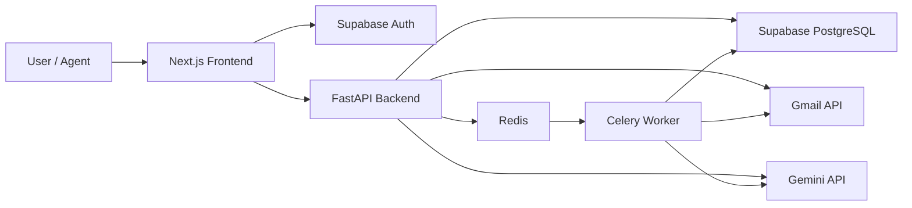
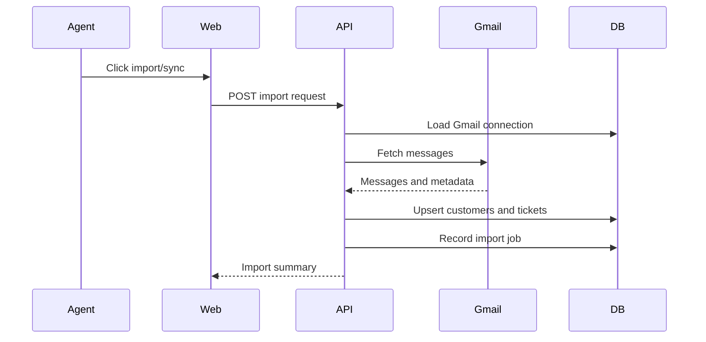
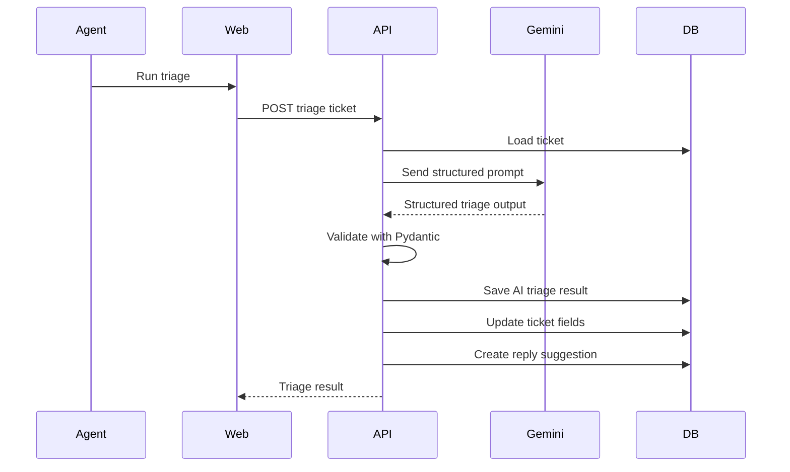
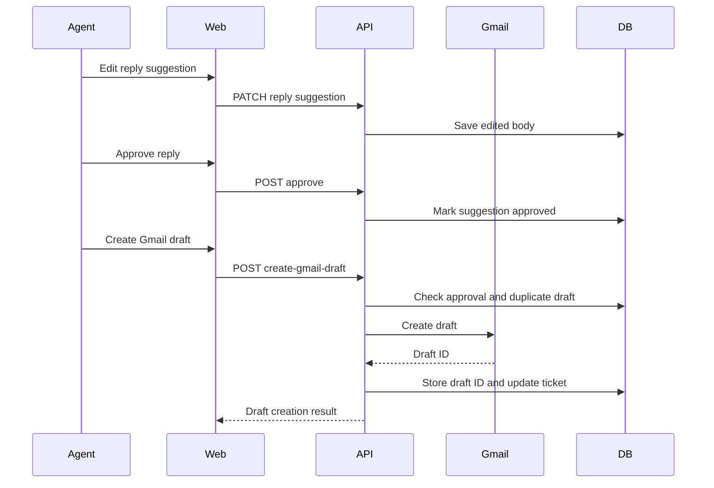

# Architecture

## High-Level Architecture



## Monorepo Layout

```text
apps/
  api/
    app/
      api/
        routes/
      core/
      db/
      integrations/
      models/
      schemas/
      services/
      worker/
    tests/
  web/
    app/
    components/
    features/
    lib/
docs/
```

## Frontend

The frontend is a Next.js TypeScript application.

Primary responsibilities:

- Authentication screens.
- Landing page.
- App shell and responsive navigation.
- Organization selection and workspace setup.
- Gmail connection and import UI.
- Ticket inbox, detail view, approvals, customers, analytics, team, and settings.
- API communication using the Supabase bearer token.

Important frontend areas:

- `apps/web/app`: route structure.
- `apps/web/features`: feature-specific UI and API helpers.
- `apps/web/components/sift`: current product UI shell and pages.
- `apps/web/lib`: shared API client, Supabase clients, and shared types.

## Backend

The backend is a FastAPI application.

Primary responsibilities:

- Validate Supabase-authenticated users.
- Enforce organization isolation and role authorization.
- Manage organizations, members, workspace settings, pilot release controls, and metrics.
- Handle Gmail OAuth and encrypted token storage.
- Import Gmail messages into tickets.
- Run Gemini triage and validate structured AI output.
- Manage reply suggestions, approvals, rejections, and Gmail draft creation.
- Write audit logs and ticket events.

Important backend areas:

- `apps/api/app/api/routes`: HTTP API routes.
- `apps/api/app/models`: SQLAlchemy database models.
- `apps/api/app/schemas`: Pydantic request/response schemas.
- `apps/api/app/services`: business logic.
- `apps/api/app/integrations`: Gmail and Gemini integrations.
- `apps/api/app/worker`: Celery worker entrypoints/tasks.

## Database

The database is PostgreSQL through Supabase.

Core tables/models:

- `organizations`
- `members`
- `workspace_settings`
- `customers`
- `tickets`
- `ticket_events`
- `gmail_connections`
- `gmail_oauth_states`
- `mail_import_rules`
- `job_runs`
- `ai_triage_results`
- `reply_suggestions`
- `reply_approvals`
- `gmail_drafts`
- `audit_logs`

## Authentication and Authorization

Supabase Auth handles identity.

The frontend sends a bearer token to the backend. The backend verifies the token and resolves the authenticated user. API services then check organization membership and role permissions before reading or writing organization resources.

Role model:

- Owner: highest organization permissions.
- Admin: operational management permissions.
- Agent: ticket and approval workflow permissions.

## Gmail OAuth and Token Storage

Gmail is connected through OAuth 2.0.

Security behavior:

- OAuth state is generated and validated.
- Refresh tokens are encrypted before being stored.
- API responses do not expose encrypted or raw token fields.
- Gmail API calls use decrypted tokens only inside backend services.

## Gmail Import Flow



Current behavior supports manual import, authenticated Gmail push notifications through Google Cloud Pub/Sub, worker-based Gmail history sync, and scheduled fallback sync discovery. M7 pilot controls can pause sync/watch behavior globally or per workspace without deleting connected Gmail data.

## AI Triage Flow



## Reply Approval and Draft Flow



## API Surface

Key endpoint groups:

- `GET /health`
- `GET /v1/status`
- `GET /v1/me`
- `POST /v1/organizations`
- `GET /v1/organizations/{organization_id}`
- `GET /v1/orgs/{organization_id}/members`
- `POST /v1/orgs/{organization_id}/members/invite`
- `PATCH /v1/orgs/{organization_id}/members/{member_id}`
- `DELETE /v1/orgs/{organization_id}/members/{member_id}`
- `GET /v1/orgs/{organization_id}/workspace-settings`
- `PATCH /v1/orgs/{organization_id}/workspace-settings`
- `GET /v1/orgs/{organization_id}/metrics/overview`
- `GET /v1/orgs/{organization_id}/tickets`
- `POST /v1/orgs/{organization_id}/tickets`
- `GET /v1/orgs/{organization_id}/tickets/{ticket_id}`
- `PATCH /v1/orgs/{organization_id}/tickets/{ticket_id}`
- `POST /v1/orgs/{organization_id}/tickets/{ticket_id}/assign`
- `POST /v1/orgs/{organization_id}/tickets/{ticket_id}/mark-spam`
- `POST /v1/orgs/{organization_id}/tickets/{ticket_id}/resolve`
- `GET /v1/orgs/{organization_id}/tickets/{ticket_id}/events`
- `GET /v1/orgs/{organization_id}/tickets/{ticket_id}/triage`
- `GET /v1/orgs/{organization_id}/tickets/{ticket_id}/triage-results`
- `POST /v1/orgs/{organization_id}/tickets/{ticket_id}/triage`
- `GET /v1/orgs/{organization_id}/tickets/{ticket_id}/reply-suggestions`
- `POST /v1/orgs/{organization_id}/tickets/{ticket_id}/reply-suggestions`
- `PATCH /v1/orgs/{organization_id}/reply-suggestions/{suggestion_id}`
- `POST /v1/orgs/{organization_id}/reply-suggestions/{suggestion_id}/approve`
- `POST /v1/orgs/{organization_id}/reply-suggestions/{suggestion_id}/reject`
- `POST /v1/orgs/{organization_id}/reply-suggestions/{suggestion_id}/create-gmail-draft`
- `GET /v1/orgs/{organization_id}/gmail/connection`
- `DELETE /v1/orgs/{organization_id}/gmail/connection`
- `GET /v1/orgs/{organization_id}/gmail/oauth/start`
- `GET /v1/gmail/oauth/callback`
- `POST /v1/orgs/{organization_id}/imports/gmail`
- `GET /v1/orgs/{organization_id}/imports/recent`
- `GET /v1/orgs/{organization_id}/audit-logs`

## Deployment Shape

Recommended deployment:

- Vercel for the Next.js frontend.
- Render or Railway for the FastAPI backend.
- Render worker service for Celery.
- Redis for job queue/broker.
- Supabase for PostgreSQL and Auth.
- Google Cloud Console for Gmail OAuth and Pub/Sub.`r`n- Staging and production pilot controls through deployment env vars plus workspace settings.

## Current Local Runtime

Current local development links:

- Frontend: `http://localhost:3002`
- Backend: `http://localhost:8001`
- Backend health: `http://localhost:8001/health`

Docker can run API, Redis, and worker locally, but normal UI/API debugging can be done with local dev servers.

## Known Architecture Gaps

- A real staging Gmail-to-draft release suite still must pass against deployed API, worker, Redis, Supabase, Google OAuth, Pub/Sub, Gmail test inbox, Gemini, and scheduler resources.
- Production-grade Gmail push sync requires correctly configured Google Cloud Pub/Sub and authenticated push delivery in each environment.
- Gmail watches must be renewed regularly once push sync is added.
- Fallback sync exists, but staging must verify scheduler/worker execution and missed-notification recovery outside local services.
- Exposed development secrets should be rotated before a real production pilot.


