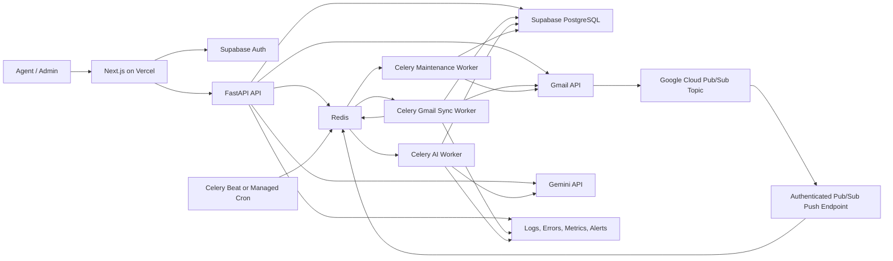

# Production Readiness Plan

**Product:** AI Customer Support Triage and Response System  
**Working product name:** Sift  
**Generated:** 2026-07-08  
**Purpose:** Turn the current working MVP into a secure, reliable, observable, pilot-ready SaaS product.

---

## 1. Executive Summary

The system already has the main end-to-end workflow:

1. A user signs in through Supabase Auth.
2. The user creates or joins an organization.
3. An owner or admin connects Gmail.
4. Gmail messages are imported as tickets.
5. Gemini classifies the ticket and creates a reply suggestion.
6. An agent edits, approves, or rejects the suggestion.
7. An approved suggestion can be created as a Gmail draft.
8. Organization actions are recorded through audit logs and ticket events.

The most important production gap is that Gmail ingestion is still manual. The first production milestone should therefore be **automatic Gmail synchronization**, followed by reliability, operational controls, security hardening, testing, and a staged pilot launch.

This plan treats the existing workflow as the product core. It does not recommend adding many new features before that core is stable.

---

## 2. Current Product Baseline

### Already implemented

- Next.js and TypeScript frontend
- FastAPI backend
- Supabase PostgreSQL
- Supabase Auth
- Organization-based multi-tenancy
- Owner, Admin, and Agent roles
- Gmail OAuth
- Encrypted Gmail refresh-token storage
- Manual Gmail import
- Duplicate Gmail-message protection
- Ticket inbox and ticket detail
- Gemini-powered structured triage
- Reply suggestion editing, approval, and rejection
- Gmail draft creation after approval
- Dashboard and analytics foundations
- Team and workspace management
- Audit logs and ticket events
- Redis and Celery foundations
- Basic CI and Docker support

### Production-critical gaps

- Automatic Gmail synchronization
- Watch renewal and sync recovery
- Reliable background-job processing
- Automatic triage for newly imported tickets
- Clear retry and failure states
- Production monitoring and alerting
- Rate limiting and abuse protection
- Full authorization test coverage
- Staging environment and release process
- Backup, recovery, and incident runbooks
- Pilot onboarding and support workflow
- Complete empty, loading, error, and disconnected states in the UI

---

## 3. Production Release Definition

The first production release is complete when a pilot organization can:

- Create a workspace and invite agents.
- Connect a Gmail support inbox securely.
- Receive new qualifying emails automatically without clicking Import.
- See sync status and the last successful sync time.
- Recover from missed Gmail notifications through fallback synchronization.
- Automatically create tickets without duplicates.
- Automatically queue AI triage for new tickets.
- Review, edit, approve, or reject AI-generated replies.
- Create a Gmail draft only after human approval.
- Assign, filter, prioritize, resolve, and audit tickets.
- Understand when a job failed and retry it safely.
- Use the application on desktop and mobile without broken workflows.
- Operate for a pilot period with logs, alerts, backups, and a documented rollback path.

### Non-goals for the first production release

Do not block the first launch on:

- Omnichannel support
- Direct email sending from the application
- Voice or chat support
- Complex enterprise billing
- Large knowledge-base ingestion
- Advanced workforce forecasting
- Fully autonomous replies
- Native mobile applications

---

## 4. Product and Engineering Principles

1. **Human approval remains mandatory.** AI may recommend and draft, but it must not send a customer reply automatically in the first production version.
2. **Every external event must be idempotent.** Duplicate Gmail and Pub/Sub events must not create duplicate tickets, triage results, or drafts.
3. **A push notification is a signal, not the source of truth.** Gmail history is the source used to discover mailbox changes.
4. **The UI must expose operational truth.** Do not show “live” or “healthy” unless the backend can verify it.
5. **Organization isolation is enforced in the backend.** Frontend filtering is never a security boundary.
6. **Background work must be retryable.** Network, Gmail, Gemini, Redis, and database failures must have defined retry behavior.
7. **Manual controls stay available.** Keep manual Sync, Retry, Re-run triage, and reconnect actions.
8. **Production features require observability.** A feature is not complete until failures are visible to operators.

---

## 5. Target Production Architecture



### Recommended deployment shape

- **Frontend:** Vercel
- **API:** Render or Railway web service
- **Workers:** Separate worker service from the API
- **Scheduler:** Celery Beat or one managed cron service
- **Redis:** Managed Redis
- **Database and Auth:** Supabase
- **Mailbox notifications:** Google Cloud Pub/Sub
- **Error tracking:** Sentry or equivalent
- **Uptime monitoring:** External health checks
- **Logs:** Structured JSON logs with searchable request and job IDs

Use one scheduler owner. Do not run duplicate schedulers across multiple API or worker instances.

---

## 6. Production Phases and Milestones

| Phase | Milestone | Primary result | Exit requirement |
|---|---|---|---|
| 0 | Baseline and release control | Completed locally | Tests pass and environments are documented |
| 1 | Automatic Gmail sync | In progress - M1 foundation completed | Push, history sync, renewal, and fallback work |
| 2 | Core workflow completion | Imported mail reliably reaches approval | Auto-triage and lifecycle states are complete |
| 3 | Operational controls | Failures can be seen and recovered | Retry, status, jobs, alerts, and runbooks exist |
| 4 | Security and data protection | Tenant and credential risks are reduced | Security checklist and tests pass |
| 5 | UI and product polish | Product is understandable and trustworthy | All critical states and responsive flows pass |
| 6 | QA, staging, and performance | Release is proven outside local development | E2E, load, failure, and migration tests pass |
| 7 | Pilot launch | Real users operate safely | Pilot checklist, monitoring, and rollback are ready |
| 8 | General availability preparation | Repeatable customer onboarding | Support, billing direction, and product metrics exist |

---

# Phase 0 — Baseline and Release Control

## Goal

Create a controlled foundation before adding live synchronization.

## Requirements

### Repository and release process

- Protect the main branch.
- Require pull requests and passing CI.
- Define `development`, `staging`, and `production` environments.
- Add a release checklist.
- Add semantic or date-based release tags.
- Document rollback steps for frontend, API, worker, and database.
- Add an ownership file or maintainer list for critical modules.

### Database migrations

- Use Alembic for every schema change.
- Prevent application startup from silently creating production tables.
- Test migration upgrade and downgrade paths in CI.
- Back up production data before destructive migrations.
- Use expand-and-contract migrations for breaking changes.

### Configuration

Create a validated settings model for:

- Supabase URL and keys
- Database URL
- Redis URL
- Gmail OAuth client details
- Gmail encryption key
- Google Cloud project, topic, and subscription
- Pub/Sub expected audience and service-account email
- Gemini API key and model
- Frontend origin
- Error-tracking DSN
- Environment name
- Logging level
- Worker concurrency
- Sync fallback interval
- Watch-renewal schedule

The API and worker must fail fast when required production settings are missing.

## Exit criteria

- CI runs backend tests, frontend linting, type checks, and production builds.
- Staging and production environment variables are separately documented.
- A migration can be applied to an empty database and an existing staging database.
- A tagged release can be deployed and rolled back.

---

# Phase 1 — Automatic Gmail Synchronization

Status: In progress. M1 completed the authenticated Pub/Sub webhook foundation, Gmail watch registration, watch renewal entrypoint, and sync-event persistence. M2 will implement Gmail history processing and recovery.

## Goal

Automatically import new Gmail messages while preserving manual sync as a fallback.

## 1.1 Google Cloud setup

- Create one Pub/Sub topic for Gmail mailbox notifications.
- Grant Gmail's publisher service account permission to publish to the topic.
- Create an authenticated push subscription.
- Configure the push endpoint to the production API.
- Validate the signed OIDC token on every Pub/Sub request.
- Verify the expected audience and service-account email.
- Use separate topics or subscriptions for staging and production.

## 1.2 Gmail watch registration

After Gmail OAuth connection:

1. Perform an initial bounded import or reconciliation.
2. Call Gmail `users.watch`.
3. Store the returned mailbox `historyId`.
4. Store the watch expiration timestamp.
5. Mark the connection as live only after all steps succeed.
6. Record a sync event and audit event.

Renew each active Gmail watch daily. The renewal job must be idempotent and safe to rerun.

## 1.3 Pub/Sub webhook behavior

Add an endpoint similar to:

```text
POST /v1/webhooks/google/gmail
```

The endpoint must:

- Validate the Pub/Sub OIDC bearer token.
- Validate request shape and size.
- Decode the Base64URL message payload.
- Extract the Gmail address and notification `historyId`.
- Resolve an active Gmail connection by normalized email address.
- Record the Pub/Sub message ID for deduplication.
- Enqueue a Gmail history-sync job.
- Return a successful response quickly.
- Avoid fetching Gmail messages inside the webhook request.

Unknown, disconnected, malformed, or unauthorized events must be logged safely without exposing tokens or message content.

## 1.4 Incremental history synchronization

The worker must:

1. Acquire a short-lived lock for the Gmail connection.
2. Load the stored `gmail_history_id`.
3. Call `users.history.list` using that checkpoint.
4. Follow all pagination tokens.
5. Collect relevant `messagesAdded` records.
6. Fetch complete message metadata and content only for relevant messages.
7. Apply import rules.
8. Upsert the customer.
9. Insert or update the ticket idempotently.
10. Queue AI triage when appropriate.
11. Update the stored history checkpoint only after successful processing.
12. Record counts, duration, result, and errors.
13. Release the lock.

### History checkpoint rule

Never advance the stored history checkpoint before all required pages and message operations have completed successfully.

### Expired history rule

If Gmail returns an invalid or expired history checkpoint:

- Mark the incremental run as needing reconciliation.
- Run a bounded full sync using configured import rules and date limits.
- Re-establish a new checkpoint.
- Record the recovery reason.
- Alert only if recovery also fails.

## 1.5 Fallback synchronization

Push notifications can be delayed or missed, so add a scheduled fallback.

Recommended behavior:

- Every 10–15 minutes, find active connections whose last successful sync is stale.
- Enqueue an incremental sync for those connections.
- Add random jitter to avoid synchronizing every mailbox at the same second.
- Do not enqueue another job when a connection is already syncing.
- Keep the manual Sync button.

## 1.6 Required data model

Extend `gmail_connections`:

```text
gmail_email
gmail_history_id
watch_expires_at
last_notification_at
last_sync_started_at
last_sync_at
last_successful_sync_at
sync_status
sync_error_code
sync_error_message
consecutive_sync_failures
watch_status
watch_error
disconnected_at
```

Add `gmail_sync_events`:

```text
id
organization_id
gmail_connection_id
trigger_type
status
pubsub_message_id
notification_history_id
start_history_id
end_history_id
messages_seen
messages_imported
messages_skipped
tickets_created
tickets_updated
duration_ms
error_code
error_message
metadata
started_at
completed_at
created_at
```

Suggested unique constraints:

- Gmail connection email per active organization connection
- Gmail message ID per Gmail connection or organization
- Pub/Sub message ID
- Gmail draft ID
- One active sync lock or sync job per connection

## 1.7 Sync states

Use explicit states:

```text
disconnected
connecting
initial_sync
active
syncing
degraded
reauthorization_required
error
paused
```

Do not represent all failures with one generic “error” state.

## 1.8 API additions

Suggested endpoints:

```text
GET  /v1/orgs/{organization_id}/gmail/sync-status
POST /v1/orgs/{organization_id}/gmail/sync
POST /v1/orgs/{organization_id}/gmail/watch/register
POST /v1/orgs/{organization_id}/gmail/watch/renew
GET  /v1/orgs/{organization_id}/gmail/sync-events
POST /v1/orgs/{organization_id}/gmail/sync-events/{event_id}/retry
POST /v1/webhooks/google/gmail
```

Watch registration and renewal endpoints should be owner/admin only. Internal scheduled jobs may call service-layer functions directly rather than public HTTP endpoints.

## Acceptance criteria

- A new matching email appears as a ticket without a manual import.
- Duplicate Pub/Sub events do not create duplicate jobs or tickets.
- Concurrent notifications for one mailbox do not corrupt the checkpoint.
- Watch renewal occurs before expiration.
- A missed notification is recovered by fallback sync.
- An expired history checkpoint triggers safe reconciliation.
- Disconnecting Gmail stops new sync jobs and removes or stops the watch.
- The UI shows live status, last successful sync, and actionable failures.
- Sync behavior is covered by unit, integration, and end-to-end tests.

---

# Phase 2 — Core Workflow Completion

## Goal

Make the full ticket-to-draft workflow reliable, fast, and consistent.

## 2.1 Automatic triage

When a new ticket is created:

- Queue AI triage automatically.
- Do not run Gemini within the Gmail sync transaction.
- Mark the ticket `triage_queued`, then `triaging`, then `triaged` or `triage_failed`.
- Use retry with exponential backoff for transient provider errors.
- Limit retries for invalid AI output.
- Store model, prompt version, latency, token usage when available, and validation result.
- Allow an agent to retry triage manually.
- Preserve previous triage versions instead of overwriting history.

## 2.2 Ticket lifecycle

Adopt one documented lifecycle and enforce legal transitions.

Suggested lifecycle:

```text
new
triage_queued
triaging
open
pending
awaiting_approval
approved
draft_created
resolved
spam
failed
```

Keep triage job state separate from customer-support status where possible. Avoid making one status field represent import, AI, approval, and support lifecycle simultaneously.

## 2.3 Reply workflow polish

- Show the source triage result and confidence.
- Clearly label AI-generated content.
- Autosave or explicitly save edited suggestions.
- Track suggestion version history.
- Require approval after the latest edit.
- Invalidate prior approval when an approved suggestion is edited.
- Prevent draft creation from stale or rejected suggestions.
- Display the Gmail thread destination before draft creation.
- Provide “Open draft in Gmail” after creation.
- Record every edit, approval, rejection, retry, and draft action.

## 2.4 Inbox behavior

- Server-side pagination
- Stable sorting
- Search by subject, sender, customer, and ticket ID
- Filters for status, priority, category, sentiment, assignment, and date
- Saved default filters per user
- Bulk assignment
- Bulk resolve and spam actions with confirmation
- Keyboard-accessible row actions
- Clear empty, loading, stale, and error states
- Optimistic UI only where rollback is safe

## 2.5 Customer records

- Deduplicate by normalized email within the organization.
- Show ticket history and latest activity.
- Show open-ticket count and priority distribution.
- Allow internal notes later, but do not mix notes with customer email content.
- Avoid exposing one organization's customer record to another organization.

## Acceptance criteria

- Every newly imported ticket reaches a visible final triage state.
- A failed triage never silently disappears.
- An edited approved response requires reapproval.
- Draft creation remains impossible without valid approval.
- Ticket state transitions are tested and auditable.
- Inbox search and filters work against realistic data volume.

---

# Phase 3 — Operational Features

## Goal

Give administrators and developers the tools to understand and recover the system.

## 3.1 Job operations

Add an internal or owner/admin operations view with:

- Queue name
- Job type
- Organization
- Connection or ticket
- Attempt count
- Current status
- Created, started, and completed times
- Last error
- Retry action
- Cancel action where safe

Recommended queues:

```text
gmail_sync
ai_triage
gmail_draft
maintenance
default
```

Use separate concurrency and rate limits for external providers.

## 3.2 Retry policy

Classify errors:

### Retryable

- Network timeout
- Gmail 429
- Gmail 5xx
- Gemini 429
- Gemini 5xx
- Temporary Redis or database connectivity issue

### Not automatically retryable

- OAuth token revoked
- Permission scope missing
- Invalid organization state
- Invalid Pub/Sub authentication
- Permanently invalid AI schema after limited correction attempts
- User-disconnected Gmail account

Use exponential backoff with jitter and a maximum attempt count.

## 3.3 Dead-letter handling

After maximum retries:

- Mark the job failed.
- Store a sanitized error.
- Increment connection or ticket failure counters.
- Surface an owner/admin action.
- Create an alert when the failure affects live ingestion.
- Support safe manual replay.

## 3.4 Monitoring

Track at minimum:

- API request count, error rate, and latency
- Worker job count, failure rate, retries, and duration
- Queue depth and oldest queued job
- Gmail notification count
- Time from Gmail notification to ticket creation
- Time from ticket creation to triage completion
- Active, degraded, and disconnected Gmail connections
- Watch renewals due and failed
- Last successful sync age
- Gemini request error rate
- Draft creation failure rate
- Database connection saturation
- Redis availability

## 3.5 Alerts

Create alerts for:

- Production API unavailable
- Worker unavailable
- Queue backlog above threshold
- Gmail connection stale beyond threshold
- Repeated watch-renewal failure
- Repeated history-sync failure
- Database or Redis outage
- Elevated 5xx rate
- Migration failure
- OAuth callback failure spike

Every alert should name an owner and link to a runbook.

## 3.6 Runbooks

Create runbooks for:

- Gmail token revoked
- Gmail watch expired
- Pub/Sub delivery failing
- Gmail history checkpoint expired
- Queue backlog
- Worker crash loop
- Redis unavailable
- Gemini unavailable
- Database migration failure
- Accidental secret exposure
- Customer requests data export or deletion
- Rollback after a bad release

## Acceptance criteria

- An operator can identify why a mailbox stopped syncing.
- Failed jobs can be safely retried.
- Alerts distinguish a single-ticket failure from a system-wide outage.
- Logs correlate HTTP requests, jobs, organizations, connections, and tickets.
- Sensitive email bodies and tokens are not written to normal logs.

---

# Phase 4 — Security and Data Protection

## Goal

Protect customer mail, credentials, and tenant boundaries.

## Requirements

### Authentication and authorization

- Verify Supabase JWTs on every protected request.
- Enforce organization membership in backend services.
- Centralize role checks.
- Add negative authorization tests for every resource group.
- Prevent IDOR by testing cross-organization IDs.
- Revoke sessions or permissions promptly after member removal.

### Gmail credentials

- Rotate all development and potentially exposed secrets.
- Use a production-managed encryption key.
- Version encrypted token records to support key rotation.
- Never return raw or encrypted refresh tokens in API responses.
- Never include tokens in logs, URLs, job arguments, or error tracking.
- Handle revoked refresh tokens as `reauthorization_required`.

### Webhook security

- Validate Pub/Sub OIDC JWT signature.
- Validate issuer, audience, service-account email, and expiration.
- Enforce HTTPS.
- Set body-size limits.
- Reject malformed payloads.
- Use Pub/Sub message IDs for deduplication.
- Return no sensitive diagnostic data to callers.

### Application security

- Production CORS allowlist only
- Security headers
- CSRF-safe OAuth flow
- OAuth state expiration and one-time use
- Rate limits on auth-adjacent, import, triage, and draft endpoints
- Request-size limits
- Input validation through Pydantic
- Dependency and container scanning
- Secret scanning in CI
- No debug mode in production
- Sanitized error responses
- Principle-of-least-privilege service accounts

### Data governance

Define:

- What email content is stored
- How long raw message bodies are retained
- How attachments are handled
- Whether deleted Gmail messages remain in the app
- Data export process
- Organization deletion process
- Backup retention
- Audit-log retention
- AI-provider data-handling disclosure
- Privacy policy and terms for pilot users

## Acceptance criteria

- Cross-tenant tests fail closed.
- Rotated credentials are deployed.
- Pub/Sub requests without valid identity are rejected.
- Logs and monitoring contain no Gmail tokens.
- A documented organization deletion procedure exists.
- Backup and restore have been tested on staging.

---

# Phase 5 — UI and Product Polish

## Goal

Make the system feel complete, predictable, and trustworthy.

## Required states for every major page

- Loading
- Empty
- Success
- Partial data
- Permission denied
- Recoverable error
- Non-recoverable error
- Disconnected integration
- Stale data
- Offline or network failure

## Navigation and hierarchy

Recommended app navigation:

```text
Overview
Inbox
Approvals
Customers
Analytics
Integrations
Team
Workspace
Settings
```

Owner/admin-only areas should be clearly marked or hidden based on permission.

## Production polish priorities

- Consistent page headers and primary actions
- One urgency color system
- Accessible contrast and focus states
- Skeleton loaders without layout shift
- Toasts for immediate actions
- Persistent banners for operational failures
- Confirmation dialogs for destructive actions
- Responsive ticket detail layout
- Mobile-friendly inbox filters
- Helpful onboarding checklist
- Contextual links between tickets, approvals, customers, and Gmail drafts
- Consistent date, time, and timezone formatting
- No demo numbers in production dashboards
- No dead navigation items

## Acceptance criteria

- A first-time owner can connect Gmail without documentation.
- An agent can identify the most urgent ticket immediately.
- Sync problems are visible without opening developer tools.
- All critical workflows are keyboard accessible.
- Mobile layouts work at common phone widths.
- No page depends on hard-coded mock data.

---

# Phase 6 — QA, Staging, and Performance

## Goal

Prove the production design before exposing real customer inboxes.

## Test layers

### Unit tests

- Role policies
- Ticket transitions
- Import-rule matching
- Gmail payload decoding
- Pub/Sub JWT validation wrapper
- History record extraction
- Message parsing
- Idempotency keys
- Retry classification
- AI schema validation
- Approval invalidation
- Draft eligibility

### Integration tests

- Supabase-authenticated API flow
- Organization isolation
- Gmail connection model behavior
- Sync-event persistence
- Worker-to-database interaction
- Redis job enqueueing
- History pagination
- Expired checkpoint recovery
- Watch renewal
- Duplicate Pub/Sub delivery
- Duplicate Gmail message import
- Gemini timeout and invalid output
- Gmail draft failure and retry

### End-to-end tests

1. Sign up.
2. Create organization.
3. Connect test Gmail.
4. Receive a new test email.
5. Verify automatic ticket creation.
6. Verify automatic triage.
7. Edit and approve reply.
8. Create Gmail draft.
9. Open draft in Gmail.
10. Resolve ticket.
11. Verify audit and ticket events.

### Failure tests

- Pub/Sub sends the same event twice.
- Two notifications arrive at the same time.
- Worker crashes after ticket insert but before checkpoint update.
- Gmail returns 429.
- Gmail token is revoked.
- Gemini returns invalid JSON.
- Redis restarts.
- Database transaction fails.
- Watch expires.
- History checkpoint returns 404.
- API deploy occurs while jobs are running.

### Performance targets for pilot

Suggested initial targets:

- API p95 under 750 ms for normal reads
- Webhook acknowledgment under 2 seconds
- New email visible within 60 seconds under normal conditions
- Triage completed within 90 seconds under normal conditions
- No duplicate tickets during concurrent delivery tests
- Inbox remains usable with at least 10,000 tickets per organization
- Worker recovery after restart without lost acknowledged work

These are product targets, not external guarantees. Measure and revise them after the pilot.

## Acceptance criteria

- Staging mirrors production services and environment shape.
- A complete E2E test passes repeatedly.
- Failure scenarios produce expected states and alerts.
- Migration and rollback tests pass.
- A release candidate completes a soak test without data corruption.

---

# Phase 7 — Pilot Launch

## Goal

Launch with a small number of controlled users and learn safely.

## Pilot requirements

- One to three pilot organizations
- Named owner for each pilot
- Dedicated support contact
- Agreed data-retention expectations
- Test Gmail account before real inbox connection
- Daily operational review during the first week
- Error and sync-health dashboard
- Written rollback and disconnect procedure
- Feedback channel
- Feature flags for risky changes

## Pilot success metrics

- Percentage of incoming support mail imported successfully
- Median notification-to-ticket latency
- Triage success rate
- Approval rate
- Draft creation success rate
- Duplicate-ticket rate
- Number of manual sync recoveries
- Number of reauthorization events
- Agent time saved per ticket
- Agent edits per AI suggestion
- Critical user-reported defects
- Weekly active agents

## Release blockers

Do not launch when any of these are true:

- Cross-organization data-access defect
- Refresh tokens appear in logs
- Duplicate ticket creation is unresolved
- Gmail sync can silently stop
- Failed syncs are invisible
- Approved-reply rules can be bypassed
- No tested backup
- No rollback process
- Production secrets are shared with development

---

# Phase 8 — General Availability Preparation

## Goal

Make onboarding repeatable beyond the first pilot.

## Requirements

- Guided onboarding
- Gmail connection troubleshooting
- Workspace defaults
- Invitation and role flows
- Usage and product analytics
- Support process
- Status page
- Privacy policy
- Terms of service
- Data processing documentation
- Plan and billing direction
- Email and in-app lifecycle communications
- Self-service organization export and deletion direction
- Feature flags and controlled migrations

---

## 7. Recommended Production Backlog Order

### P0 — Must finish before pilot

1. Environment and migration baseline - completed in M0
2. Pub/Sub authenticated webhook - foundation completed in M1
3. Gmail watch registration and daily renewal - foundation completed in M1
4. Incremental history sync - next in M2
5. Idempotency and per-connection locking
6. Fallback sync and expired-history recovery
7. Sync status UI
8. Automatic triage queue
9. Core lifecycle and approval consistency
10. Worker retries and failed-job visibility
11. Security tests and secret rotation
12. End-to-end staging test
13. Monitoring, alerts, backup, and rollback

### P1 — Complete during or immediately after pilot

1. Saved inbox views
2. Bulk assignment and resolve
3. Reply version history
4. Operational admin page
5. Response templates
6. SLA timers
7. Routing and assignment rules
8. Improved analytics
9. Customer timeline
10. Onboarding checklist

### P2 — Post-pilot product expansion

1. Workspace knowledge base
2. Knowledge-grounded reply generation
3. Advanced automation rules
4. Additional Gmail accounts per workspace
5. Attachments
6. Internal notes and mentions
7. Collision detection for multiple agents
8. Direct send with explicit confirmation and stronger controls
9. Billing
10. Additional channels

---

## 8. Definition of Done

A production feature is done only when:

- Product behavior is documented.
- Authorization rules are defined.
- Database changes use migrations.
- API validation is complete.
- Background jobs are idempotent.
- Retries and terminal failures are defined.
- Audit events are included where appropriate.
- Loading, empty, success, and error UI states exist.
- Unit and integration tests pass.
- Observability is implemented.
- Staging verification passes.
- Rollback or disablement is possible.
- User-facing documentation is updated.

---

## 9. Official Gmail Sync Implementation References

- [Configure push notifications in Gmail API](https://developers.google.com/workspace/gmail/api/guides/push)
- [Gmail users.watch](https://developers.google.com/workspace/gmail/api/reference/rest/v1/users/watch)
- [Gmail users.history.list](https://developers.google.com/workspace/gmail/api/reference/rest/v1/users.history/list)
- [Authenticate Pub/Sub push subscriptions](https://cloud.google.com/pubsub/docs/authenticate-push-subscriptions)

